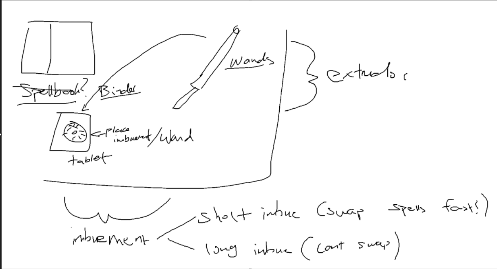
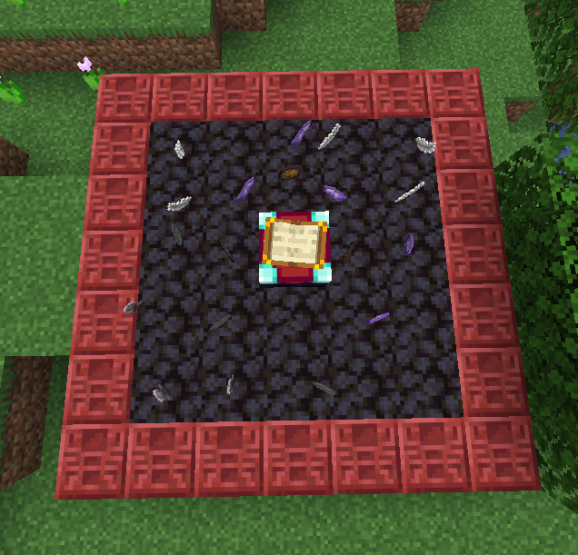
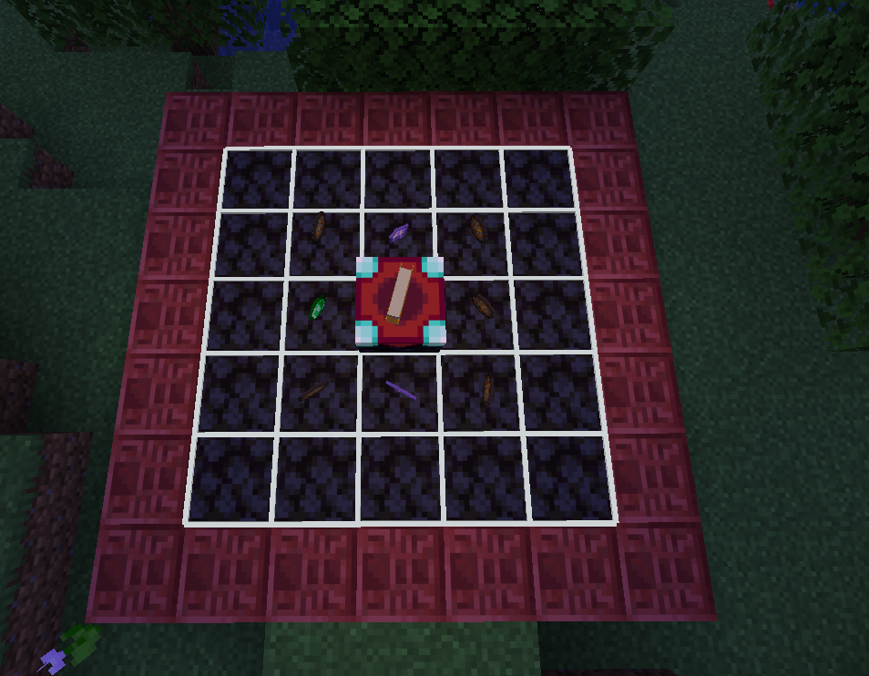

# journal of doom and despair
hello, journaling for fun why not!!

## brainstorming
here are some of the basic ideas for this project, just so i can keep it outlined/streamlined and i know what i'm looking at!!

some of the though processes behind the picture:
- i didnt want to have a spellbook since that would make it wayy too similar to many other magic mods
- i wanted for you to be able to cast spells using ANY item
- i wanted spells to be configurable to the extreme (oof pain)

some central ideas i want to add:

- IMBUEMENTTT:
  - you will be able to imbue stuff, which grants magical properties to the items
  - "spells" are casted via imbuing tablets, and extruders (see later), are able to channel those tablets into spells!
  - you can also imbue other items, such as armor to grant flight etc
    - short vs long imbue
      - i actually hate this feature, originally a timelock but thats not the point of this plugin
- EXTRUDERS
  - these are items that are able to process imbued items and channel them outward

ok lets get to work on the magic system... how do i want to let you imbue things??

i think im stuck in between an inventory UI or like doing it interactive in game
- now looking after ive developed the inventory system, its limited in the way that there arent enough inventory slots in a chest :(
- okay! new idea, you place down the imbuement table as the central block, and then you need a block of amethyst under the table
- then you place smooth stone in a circular arrangement, the bigger this arrangement the more resources you need to feed the table, but the more stuff you can throw into the spell
- i think instead of stone, idk some other block thats magicky
- 

the pros of inventory ui is that its a lot easier to visaulize, but the in world version would just be so much cooler lmao

i think in-world is actually so much harder to implement, as cool as it is, id rather do it in an inventory and then have a super cool animation after in-world

## finalizing ideas
ok. here is the new thing:

this is a prototype idea for a spell that is a direct bolt, and then turns into an explosion
- the middle items will determine the element of the spell (in this case fire)
- the idea is that for 60% of the spells lifetime, it will be a direct bolt (as per the amethyst)
- but the last 40% will be an explosion (as per the firework star)
- the feathers will directly speed up the bolts speed
- and then the flowers on the bottom will make the explosion bigger

now the problem i face is, how can i add logic to the spells??
- say i want to explosion to activate only if the bolt hits something
- i could use the imbuement table for this??
- or, a different workstation that allows you to fuse modifiers together, creating new effects when used to well, modify things
- i think thats the better approach here

shower thought/alternative idea:
- each circle of the imbuement is another "layer" of the spell
- for example, the first layer could be fire charges + amethyst in order to create a fireball
- then after the first layer is completed, the second layer of the spell will begin
- then the third
- etc
- this is balanced out by the fact that each layer it requires more resources??
- should also maybe charge XP to imbue, more expensive for each layer
- maybe some sort of leveling system too, like you need to upgrade your imbuement setup

so with this new proposed system, i could have a single amethyst shard with 3 fire charges to create a really short ranged fireball, then have firework stars on the second layer to create a massive explosion after the bolt is completed.

this will also allow me to give an "end logic" to each modifier item?? where amethyst shard for example will stop and move to the next layer if it hits a block/target or it expires, whilst a prismarine shard could be an ethereal bolt that doesnt have an end condition other than expiration.
i think i rather add an end logic modifier item instead of adding it onto the existing modifier items. (what a wordful)

## building it!

ok!!

i got the pick and place system working, now its time to finalize this system
i got some feedback from a friend!! (thank you cat)

if you have an emerald in your spell layer, the next layer will act exclusively as ONLY spell modifiers

if you have a netherite ingot in your spell layer, the next layer will be COMBINED with your existing spell layer

i might want to make it so that it requires more resources the more layers youre combing together too just for balance

items will bring pros and cons, so you have to kinda balance them out (inspired by binding of the saac)

now establishing some "primary items":
### primary items
- elemental items (these give the spell appearances and elemental effects)
- casting item (these change up how your spell is cast, and then moves)
- layer modifier (these change how the spell layer interacts with other spell layers)
- spell modifier (these change how casting modifiers are basically)
- specific modifiers (only apply in specific scenarios fun i know)

#### big list of item examples for now (so i have a list to work with and make)
##### elemental items:
more of these = more intense

i dont even know if i want these at all i mean can spice shit up
- fire charge: flame
- ice: ice
- redstone: blood!!

##### casting item:
more of these = priority? (how would i handle multiple of these in one layer? i guess just run both!!)

for example, if i have equal amounts of amethyst and heart of the seas, it will just do both.

but if theres more amethyst, there will be circles coming out of the line and vice versa??
- amethsyt shard: straight line
- heart of the sea: circle

##### layer modifier:
can only have one of these? in each layer
- emerald: the next layer will only accept spell modifiers
- netherite: the next layer will expand to connect to the current layer basically

##### spell modifier:
changes shit
- feather: spell tends to go up
- cobblestone: the spell tends to go down
- rabbit foot: the spell goes faster
- 